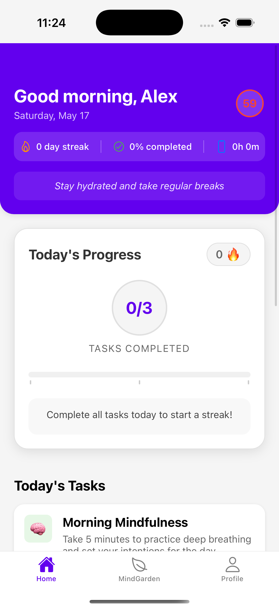
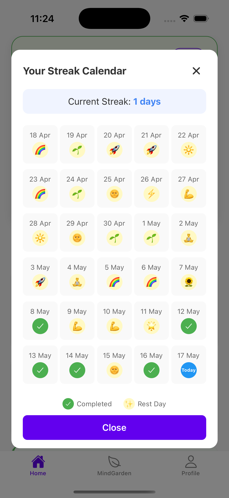
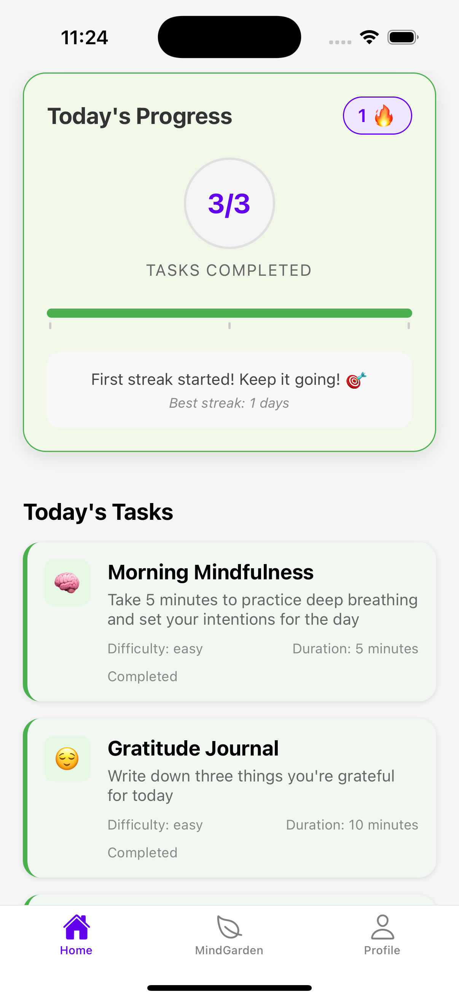

# MindSpace


## 🧠 About MindSpace

MindSpace is a mental wellness application designed to support users in maintaining good mental health through subtle daily interventions. In today's fast-paced digital world where boundaries between work and rest are blurring, MindSpace provides a sanctuary for users to pause, breathe, and reconnect with themselves—transforming technology from part of the problem into part of the solution.

## 🏆 MEET IT HACKATHON 2025 Submission
- **Team #2: "Cyfrowy Monety"**
- **Members:** Daniyar Zhumatayev, Tymon Podlaszewski, Mikołaj Pułaski, Ernest Kmieciak

## 🌟 Key Features

- **Personalized Assessment Engine:** Simple, intuitive sliders for non-intimidating self-evaluation
- **Emotional Growth Visualization:** A "Mind Garden" that evolves as users develop healthy habits
- **Digital Wellness Monitor:** Passive tracking of screen time and app usage with gentle intervention nudges
- **Micro-Intervention System:** Contextual 2-15 minute activities based on user's current state
- **Voice Input Processing:** Convert spoken thoughts into insights through voice-to-text analysis
- **Safe Community Features:** AI-moderated note sharing between users for positive interactions

## 🔧 Technology Stack

- **Frontend:** React Native with Expo
- **Backend:** Python with FastAPI
- **AI Implementation:**
  - Task personalization algorithm based on user assessments and inputs
  - Voice-to-text conversion module (SST_meetIT)
  - Content moderation system for user interactions
- **Data Storage:** On-device processing for sensitive data with MongoDB backend
- **Authentication:** JWT-based secure authentication

## 📱 Screenshots





## 🚀 Getting Started

### Prerequisites

- Node.js (v14+)
- Python (v3.8+)
- npm or yarn
- Expo CLI
- Virtual device or physical device for testing

### Installation

1. Clone the repository
   ```
   git clone https://github.com/cyrowy-monety/mindspace.git
   cd mindspace
   ```

2. Install frontend dependencies
   ```
   npm install
   # or
   yarn install
   ```

3. Set up backend
   ```
   cd backend
   pip install -r requirements.txt
   ```

### Running the Application

1. Start the backend server
   ```
   cd backend
   python -m uvicorn assessment_api:app --reload
   ```

2. Start the Expo server (in a new terminal)
   ```
   # From the root directory
   npx expo start
   ```

3. Choose your platform:
   - Press `i` for iOS simulator
   - Press `a` for Android emulator
   - Press `w` to open in a web browser

## 📊 Project Structure

```
mindspace/
├── assets/                  # Images, fonts and other static assets
├── components/              # Reusable React components
│   ├── assessment/          # Assessment sliders and evaluation components
│   ├── mindgarden/          # Mind Garden visualization components
│   └── tasks/               # Micro-intervention task components
├── screens/                 # Application screens
├── navigation/              # Navigation configuration
├── hooks/                   # Custom React hooks
├── context/                 # React context providers
├── utils/                   # Utility functions
│   ├── ai/                  # AI processing utilities
│   └── analytics/           # Usage pattern analysis
├── SST_meetIT/              # Voice-to-text conversion module
├── backend/                 # Python FastAPI backend
│   ├── models/              # Data models
│   ├── ai_modules/          # AI processing modules
│   ├── routes/              # API routes
│   └── services/            # Business logic
└── App.js                   # Entry point
```

## 🧪 Core Components

### Assessment & Personalization Engine
- Clean, intuitive UI with slider interface for non-intimidating evaluation
- Focus area selection (Emotional Care, Physical Well-Being) enabling user agency
- AI-powered personalization of tasks based on initial assessment, chosen topics, and user inputs

### AI Implementation Details
- **Task Personalization:** AI analyzes user's test responses, chosen topics, and additional input to recommend personalized wellness activities
- **Voice-to-Text Conversion:** Built-in microphone support converts spoken thoughts into text for AI analysis, generating contextually appropriate tasks
- **Content Moderation:** AI system monitors and filters user-to-user notes to maintain a safe, positive environment (blocking content related to alcohol, drugs, inappropriate material, etc.)

### Micro-Intervention System
- Task cards with duration estimates (5-15 minutes) making activities accessible
- Self-reflection prompts, mood tracking, and self-care activities
- Contextual suggestions based on detected emotional states

### Emotional Growth Visualization
- Mind Garden as a visual representation of mental well-being
- Emotion tracking with pattern recognition
- Progress visualization that's engaging without being clinical

## 🔒 Privacy and Security

MindSpace is designed with user privacy as the highest priority:
- On-device processing for sensitive data
- Transparent data policies with user-friendly explanations
- Complete user control over monitoring features
- No personally identifiable information shared with third parties

## 🏆 Evaluation Criteria Addressed

1. **Quality and Content of Presentation** - Our solution directly addresses the growing issue of mental health challenges among young adults through evidence-based interventions

2. **Creativity** - The Mind Garden visualization serves as an emotional digital twin, providing a unique and memorable representation of mental well-being

3. **User Experience** - Clean, intuitive interface with green accents conveying growth and wellness, designed to minimize cognitive load during vulnerable moments

4. **Working Prototype** - Complete user journey from assessment to personalized tasks to progress tracking with immediate feedback

5. **Technical Difficulty** - Multi-modal input processing (text, voice) with AI-driven task personalization and content moderation

6. **Use of Artificial Intelligence** - Three-fold AI implementation: personalized task recommendation, voice-to-text analysis for mental state assessment, and user content moderation for safe interactions

7. **Adherence to Theme** - Direct focus on supporting mental well-being through subtle daily actions rather than clinical diagnosis, transforming technology from part of the problem to part of the solution

## 📝 License

This project was created for the MEET IT HACKATHON 2025 and is licensed under the MIT License.

## 🙏 Acknowledgements

- MEET IT HACKATHON 2025 organizers
- Our mentors and mentors
- Open-source libraries and frameworks used in this project 